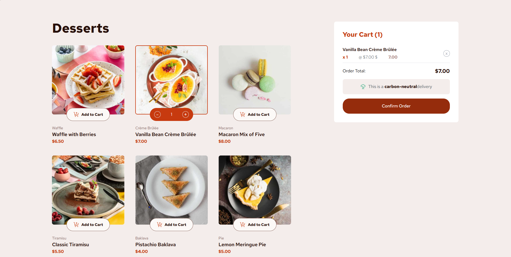
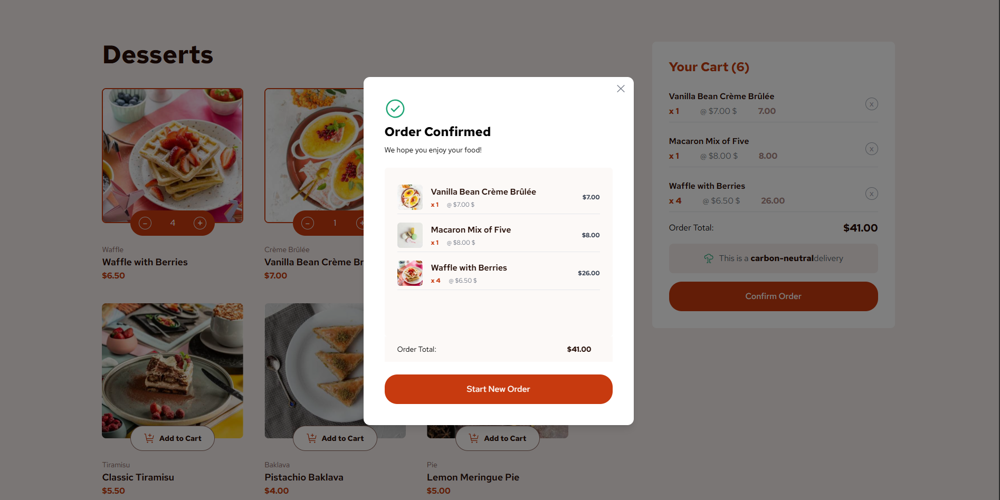

# Frontend Mentor - Product list with cart solution

This is a solution to the [Product list with cart challenge on Frontend Mentor](https://www.frontendmentor.io/challenges/product-list-with-cart-5MmqLVAp_d). Frontend Mentor challenges help you improve your coding skills by building realistic projects. 

## Table of contents

- [Overview](#overview)
  - [The challenge](#the-challenge)
  - [Screenshot](#screenshot)
  - [Links](#links)
- [My process](#my-process)
  - [Built with](#built-with)
  - [Continued development](#continued-development)
  - [Useful resources](#useful-resources)
- [Author](#author)

## Overview

### The challenge

Users should be able to:

- Add items to the cart and remove them
- Increase/decrease the number of items in the cart
- See an order confirmation modal when they click "Confirm Order"
- Reset their selections when they click "Start New Order"
- View the optimal layout for the interface depending on their device's screen size
- See hover and focus states for all interactive elements on the page

### Screenshot

### Links

- Solution URL: [Github](https://github.com/ismanolgarcia/product-list-with-cart)
- Live Site URL: [Product List Cart](https://product-list-cart-jsx.netlify.app/)

## My process

### Built with

- [React](https://reactjs.org/) - JS library
- [Tailwind CSS](https://tailwindcss.com/) - For styles

### Continued development

Both React Next.js and Astro provide a rich ecosystem of libraries and tools that facilitate web application development. By exploring options like Zustand, React Query, and Framer Motion, you can enhance state management, data fetching, and animations in your projects. Additionally, styling libraries such as styled-components allow you to customize the appearance of your user interfaces.

### Useful resources

 [Create Modal](https://www.geeksforgeeks.org/create-modal-dialogs-ui-using-react-and-tailwind-css/) - This tutorial provided a clear and concise approach to creating modals using React and Tailwind CSS. I particularly liked the use of state management to control the modal's visibility and the implementation of animations for a smooth user experience. I will definitely be incorporating these patterns into my future projects.

## Author

- Website - [Ismanol García](https://www.ismanolgarcia.com)
- X - [@ismanolgarcia](https://www.twitter.com/ismanolgarcia)
- Frontend Mentor - [@ismanolgarcia](https://www.frontendmentor.io/profile/ismanolgarcia)
- GitHub- [@ismanolgarcia](https://github.com/ismanolgarcia/)

